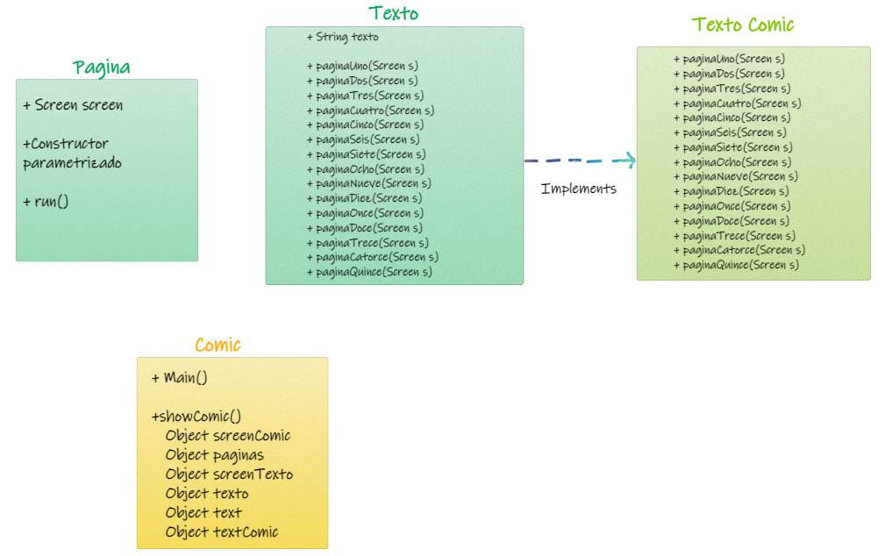
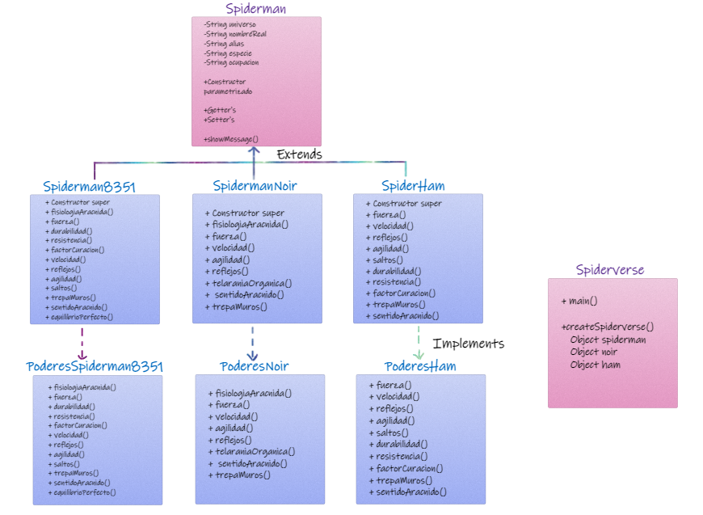

# Backend Java

## Práctica Line Up (Multihilos)

Diseñar el line up de un concierto. Se debe contemplar la presentacion de cada artista, canciones, imagen, etc. 

**NOTA:**

Para esta práctica se utilizo el framework `inmosh`, el cual no se encuentra en el repositorio debido a que es privado.

Para hacer uso de este, se añadieron los archivos del framework en un paquete nombrado imonsh. 

Para realizar está práctica se utilizaron canciones de las bandas `Avatar`, `Lacrimosa`, `Rammstein` y `Slipknot` las cuales no se incluyen en el repositorio debido a los derechos de autor.

### Entregables 

### Clases:

[Clase Banda](./practicaLineUp/Banda.java)

[Clase Avatar](./practicaLineUp/Avatar.java)

[Clase Lacrimosa](./practicaLineUp/Lacrimosa.java)

[Clase Rammstein](./practicaLineUp/Rammstein.java)

[Clase Slipknot](./practicaLineUp/Slipknot.java)

[Interfaz PresentacionBanda](./practicaLineUp/presentacionBanda.java)

[Clase Concierto](./practicaLineUp/Concierto.java)

### Programa funcionando:

**NOTA:**

Para ver el programa funcionando dar [clic aquí](https://vimeo.com/707448381) o en el gif que se muestra a continuación: 

[Video del programa funcionando](./practicaLineUp/Lineup.mp4)

### Diagramas:

## Práctica Cómic (Hilos)

Crear un cómic modelando las clases, interfaces e hilos correspondientes para contar una historia de 2 minutos de duración.

**NOTA:**

Para esta práctica se utilizo el framework `inmosh`, el cual no se encuentra en el repositorio debido a que es privado.

Para hacer uso de este, se añadieron los archivos del framework en un paquete nombrado imonsh. 

Para realizar está práctica se utilizaron imágenes del cómic `The Umbrella Academy #0 First Appearance Free Comic Book Day 2007` las cuales no se incluyen en el repositorio debido a los derechos de autor.

### Entregables 

### Clases:

[Clase Pagina](./practicaComic/Pagina.java)

[Clase Texto](./practicaComic/Texto.java)

[Interfaz TextoComic](./practicaComic/TextoComic.java)

[Clase Comic](./practicaComic/Comic.java)

### Programa funcionando:

[Video del programa funcionando](./practicaComic/Comic.mp4)

### Diagramas:

## Práctica Multiverse (Interfaces)

Modelar 3 personajes del Spiderverse que hereden de la clase Spiderman.

**NOTA:**

Para esta práctica se utilizo el framework `inmosh`, el cual no se encuentra en el repositorio debido a que es privado.

Para hacer uso de este, se añadieron los archivos del framework en un paquete nombrado imonsh. 

### Entregables 

### Clases:

[Clase Spiderman](./practicaMultiverse/Spiderman.java)

[Clase Spiderman8351](./practicaMultiverse/Spiderman8351.java)

[Clase SpidermanNoir](./practicaMultiverse/SpidermanNoir.java)

[Clase SpiderHam](./practicaMultiverse/SpiderHam.java)

[Interfaz PoderesSpiderman8351](./practicaMultiverse/PoderesSpiderman8351.java)

[Interfaz PoderesNoir](./practicaMultiverse/PoderesNoir.java)

[Interfaz PoderesHam](./practicaMultiverse/PoderesHam.java)

[Clase Spiderverse](./practicaMultiverse/Spiderverse.java)

### Programa funcionando:

[Video del programa funcionando](./practicaMultiverse/Spiderverse.mp4)

### Diagramas:

## Práctica Mona (Herencia y Polimorfismo)

Modelar 6 versiones de Mona The Octocat que extienden de la clase Mona

### Entregables

### Clases:

[Clase Mona](./practicaMona/Mona.java)

[Clase MonaBombero](./practicaMona/MonaBombero.java)

[Clase MonaDJ](./practicaMona/MonaDJ.java)

[Clase MonaJugadorAmericano](./practicaMona/MonaJugadorAmericano.java)

[Clase MonaLaboratorista](./practicaMona/MonaLaboratorista.java)

[Clase MonaLuchador](./practicaMona/MonaLuchador.java)

[Clase MonaMusico](./practicaMona/MonaMusico.java)

[Clase MonaMain](./practicaMona/MonaMain.java)

### Programa funcionando:

### Diagramas:

## Práctica Harry (Modelado)

Modelar 5 personajes de la saga Harry Potter que se definan por constructor o setters y getters.

### Entregables 

### Clases:

[Clase Wizard](./practicaHarry/Wizard.java)

[Clase WizardTest](./practicaHarry/WizardTest.java)

### Programa funcionando:

### Diagramas:

## Práctica Jujutsu (Modelado)

Modelar 4 personajes del anime Jujutsu Kaisen que se definan por constructor o setters y getters.

### Entregables 

### Clases:

[Clase Hechicero](./practicaJujutsu/Hechicero.java)

[Clase PruebaHechicero](./practicaJujutsu/PruebaHechicero.java)

### Programa funcionando:

### Diagramas:

## Práctica Cazador (Modelado)

Modelar 3 personajes del anime Kimetsu no Yaiba que se definan por constructor o setters y getters.

### Entregables 

### Clases:

[Clase Cazador](./practicaCazador/Cazador.java)

[Clase PruebaCazador](./practicaCazador/PruebaCazador.java)

### Programa funcionando:

### Diagramas:

